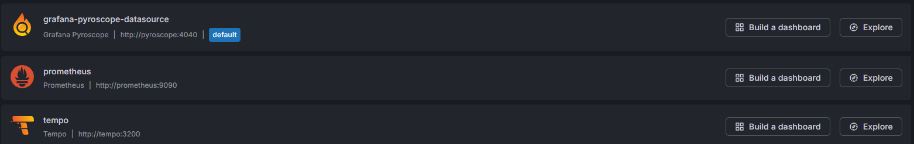
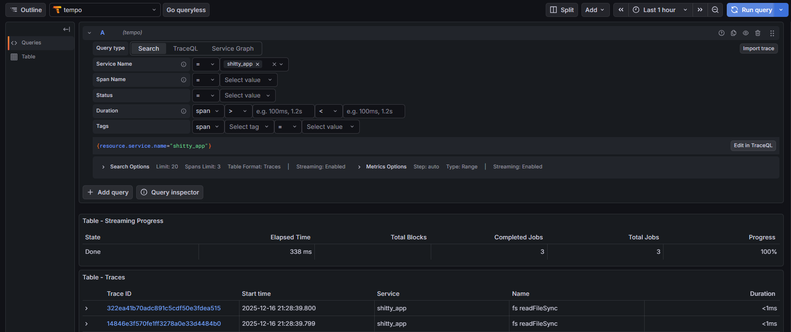
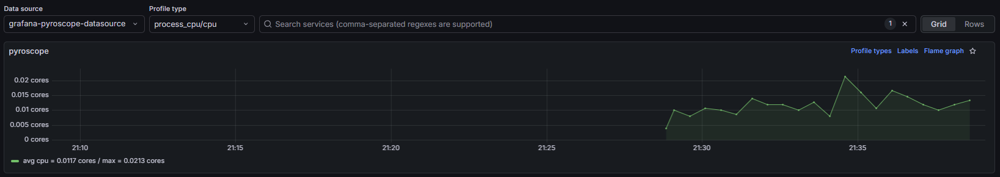

# Compte rendu - TP 1

## TP1 Part 3

---

## 2. Let's go

### Récupérer la nouvelle app

* all files content added

```info
- first add, package.json and app.js files 

- second insert, content from gitlab depot

- then, add Dockerfile
```

### Récupérer le dernier compose.yml

* compose.yml added success

```info
services:
  db:
    image: mysql:8.4
    container_name: db
    environment:
      - MYSQL_ROOT_PASSWORD=root
      - MYSQL_DATABASE=app_db
    volumes:
      - db_data:/var/lib/mysql

  pma:
    image: phpmyadmin
    container_name: pma
    ports:
      - "8080:80"
    environment:
      - PMA_HOST=db
      - PMA_PORT=3306

  app:
    image: shitty_app_with_db:1.0
    container_name: app
    ports:
      - "3000:3000"
    volumes:
      - ./src:/app/src
    environment:
      - DB_HOST=db
      - DB_USER=root
      - DB_PASSWORD=root
      - DB_NAME=app_db
      - DB_PORT=3306
      - PORT=3000
      - OTEL_SERVICE_NAME=shitty_app
      - OTEL_EXPORTER_OTLP_ENDPOINT=http://tempo:4318
      - OTEL_EXPORTER_OTLP_PROTOCOL=http/protobuf
    depends_on:
      - db
      - tempo

  pyroscope:
    image: grafana/pyroscope:latest

  tempo:
    image: grafana/tempo:latest
    command: ["-config.file=/etc/tempo.yaml"]
    volumes:
      - ./tempo.yaml:/etc/tempo.yaml

  prometheus:
    image: prom/prometheus:latest
    command:
      - '--config.file=/etc/prometheus/prometheus.yml'
      - '--storage.tsdb.path=/prometheus'
      - '--web.console.libraries=/etc/prometheus/console_libraries'
      - '--web.console.templates=/etc/prometheus/consoles'
      - '--web.enable-lifecycle'
    volumes:
      - ./prometheus.yml:/etc/prometheus/prometheus.yml:ro
      - prom_data:/prometheus
    ports:
      - "9090:9090"
    restart: always
    depends_on:
      - tempo

  grafana:
    image: grafana/grafana:latest
    ports:
      - "8000:3000"
    environment:
      - GF_PLUGINS_PREINSTALL_SYNC=grafana-pyroscope-app
      - GF_AUTH_ANONYMOUS_ENABLED=true
      - GF_AUTH_ANONYMOUS_ORG_ROLE=Admin
      - GF_AUTH_DISABLE_LOGIN_FORM=true
    depends_on:
      - prometheus

volumes:
  db_data:
  prom_data: 
```

### Lancer la stack

```bash
  curl http://localhost:3000
```

* app success

```info
StatusCode        : 200
RawContent        : HTTP/1.1 200 OK
```

```bash
  curl http://localhost:8000
```

* grafana success

```info
StatusCode        : 200
RawContent        : HTTP/1.1 200 OK
```

### Un peu de conf Grafana

* Data sources



* Traces



* Profiling



### Preuve que ça tourne !

```bash
  docker compose ps
```

* compose success

```info
NAME                 IMAGE                      COMMAND                  SERVICE      CREATED          STATUS          PORTS
app                  shitty_app_with_db:1.0     "docker-entrypoint.s…"   app          11 minutes ago   Up 11 minutes   0.0.0.0:3000->3000/tcp, [::]:3000->3000/tcp
db                   mysql:8.4                  "docker-entrypoint.s…"   db           29 minutes ago   Up 11 minutes   3306/tcp, 33060/tcp
part3-grafana-1      grafana/grafana:latest     "/run.sh"                grafana      29 minutes ago   Up 11 minutes   0.0.0.0:8000->3000/tcp, [::]:8000->3000/tcp
part3-prometheus-1   prom/prometheus:latest     "/bin/prometheus --c…"   prometheus   29 minutes ago   Up 11 minutes   0.0.0.0:9090->9090/tcp, [::]:9090->9090/tcp
part3-pyroscope-1    grafana/pyroscope:latest   "/usr/bin/pyroscope …"   pyroscope    29 minutes ago   Up 11 minutes   4040/tcp
part3-tempo-1        grafana/tempo:latest       "/tempo -config.file…"   tempo        29 minutes ago   Up 11 minutes
pma                  phpmyadmin                 "/docker-entrypoint.…"   pma          29 minutes ago   Up 11 minutes   0.0.0.0:8080->80/tcp, [::]:8080->80/tcp
```

### En vous aidant de la WebUI

* Temps moyen de réponse de la route API GET /

```info
State   Elapsed Time
Done    192 ms
```

* Temps moyen de réponse de la route API POST /add

```info
State   Elapsed Time
Done    196 ms
```

* Quantité de RAM utilisée pour un GET /

```info
Start time                  Trace Service   http.heap_delta_kb
2025-12-16 22:05:07.833     shitty_app      53.0234375
```

---